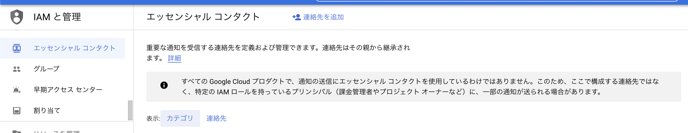
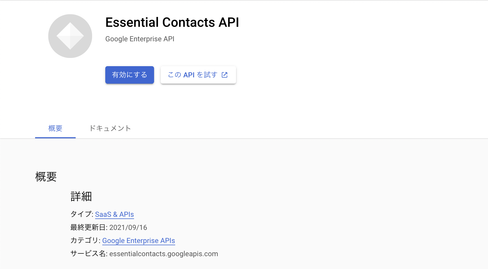
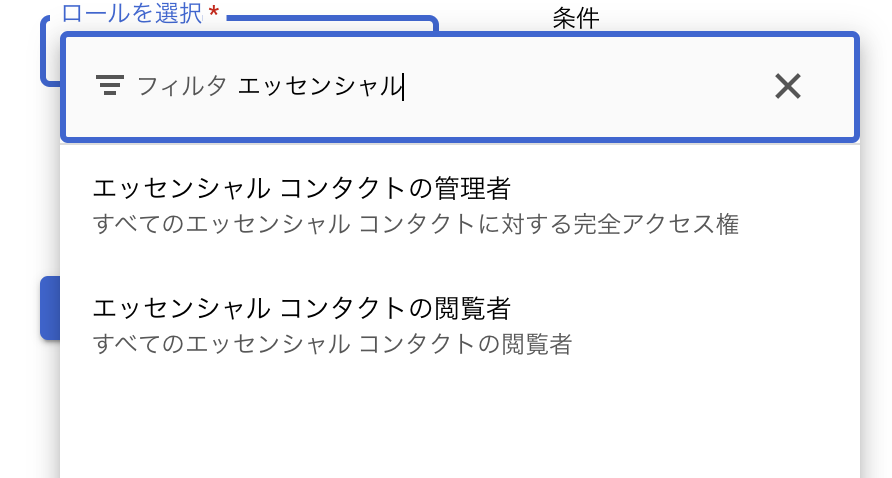
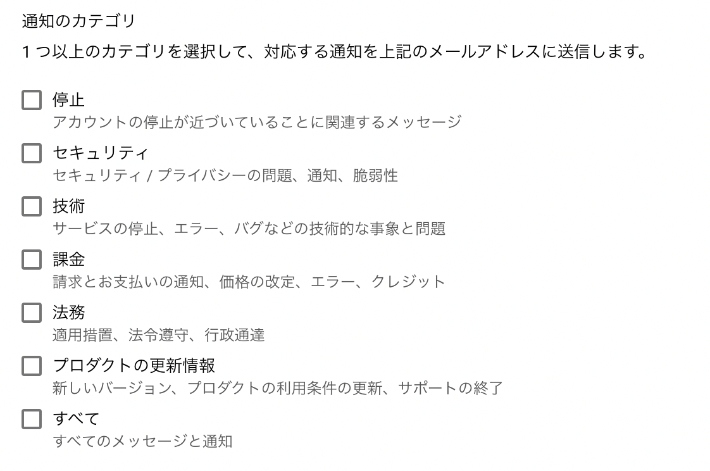
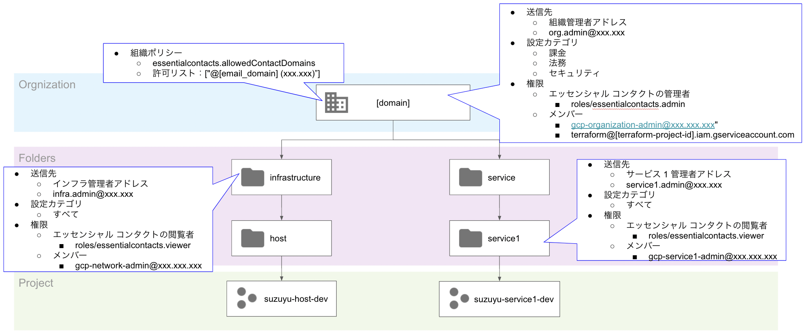
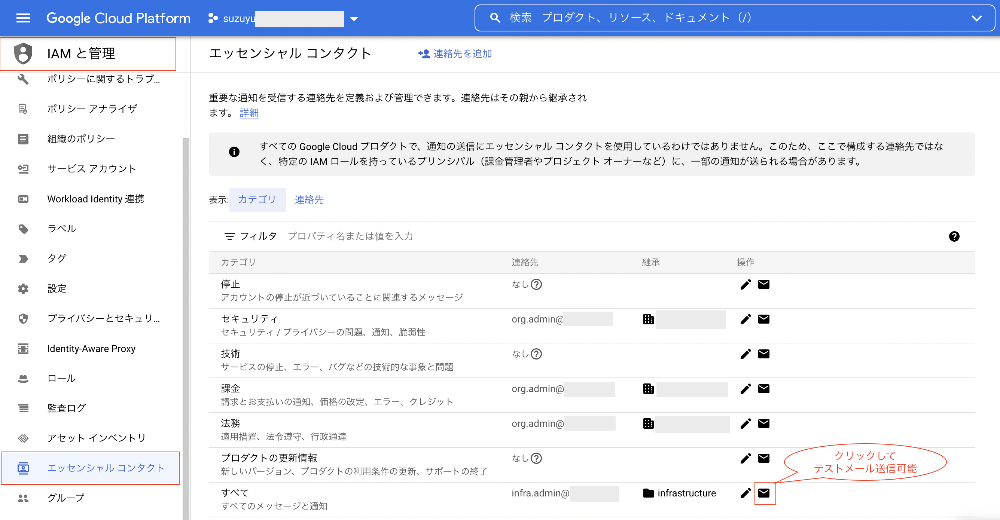
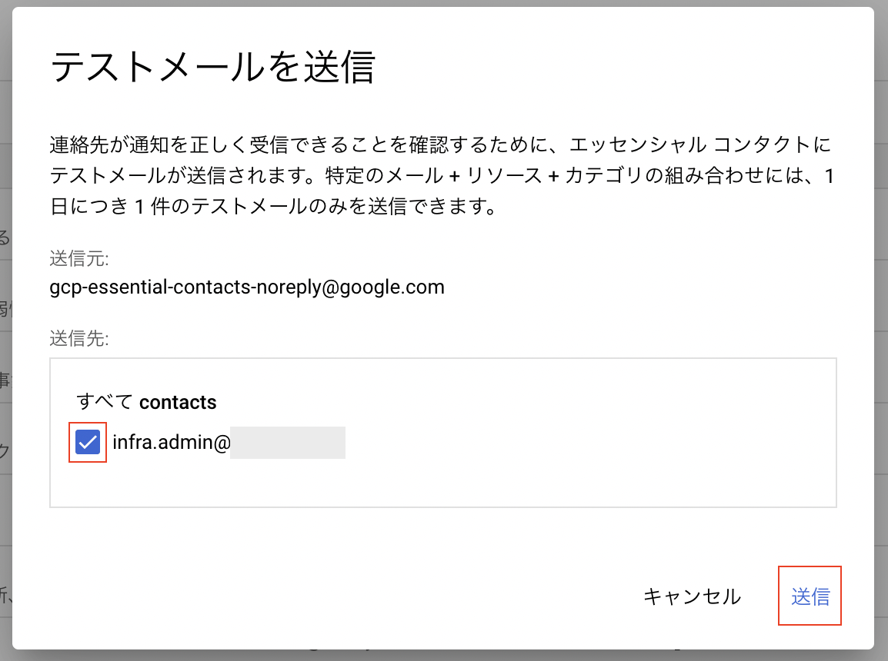
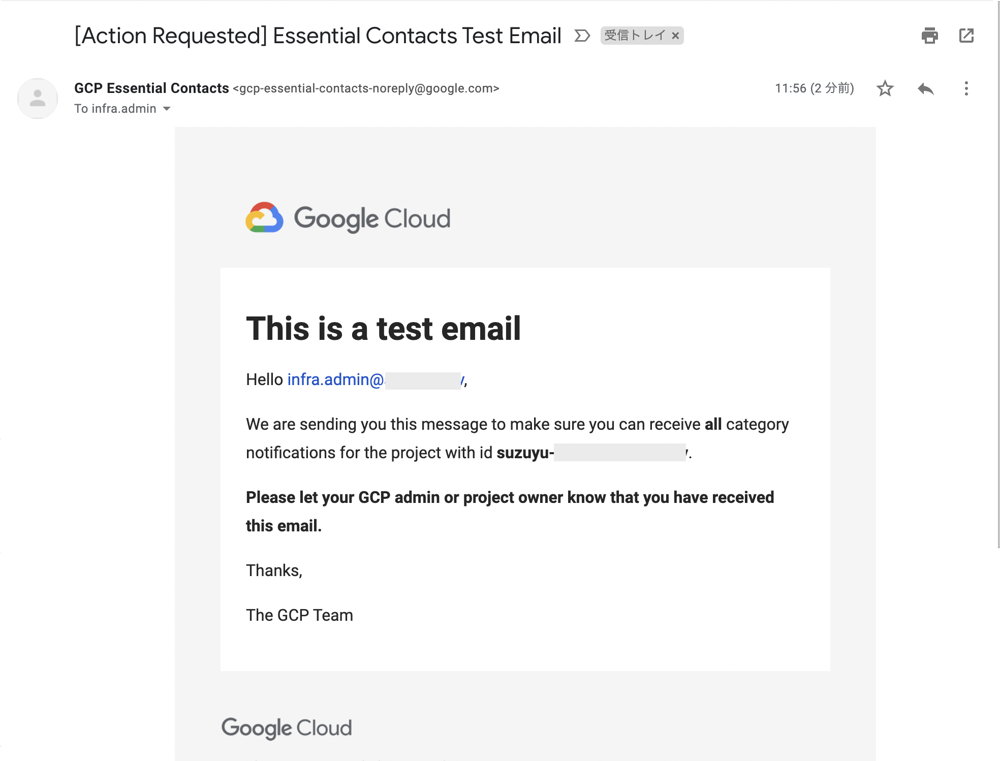

Google Cloud Essential Contacts
====

エッセンシャル コンタクト (Essential Contacts) を使用する場合、独自の連絡先リストを指定することで、通知を受け取るユーザーをカスタマイズできる

今回、Essential Contacts について確認したことと、実際にラボ設定したのでその内容を記載する



## 概要

[ドキュメント](https://cloud.google.com/resource-manager/docs/managing-notification-contacts)からの抜粋

### 必要な API

[Essential Contacts API を有効にする](https://console.cloud.google.com/flows/enableapi?apiid=essentialcontacts.googleapis.com&_ga=2.16018354.568551355.1644550687-669251723.1606488380)必要がある




### 必要な権限

| 権限内容 | ロールの選択で出る名称| 事前定義ロール | 必要権限 |
|:-:|:-:|:-:|:-:|
| 連絡先の閲覧権限 | エッセンシャル コンタクトの管理者 | roles/essentialcontacts.viewer | essentialcontacts.contacts.get <br> essentialcontacts.contacts.list |
| 連絡先を管理する権限 | エッセンシャル コンタクトの閲覧者 | roles/essentialcontacts.admin | essentialcontacts.contacts.get <br> essentialcontacts.contacts.list <br> essentialcontacts.contacts.create <br> essentialcontacts.contacts.delete <br> essentialcontacts.contacts.update <br>  |




### 通知のカテゴリ

- 連絡先は、複数の**通知カテゴリ**に割り当てることができる
- **カテゴリに連絡先を追加しない場合**は、**フォールバックの連絡先に送信**される
- フォールバックの連絡先を使用せずに、**カスタムの連絡先を追加することが推奨**されている
- 個人とグループの両方を連絡先として追加でき、人事異動の影響を減らすため、グループを連絡先が推奨



具体的なカテゴリとフォールバック先は、[ドキュメントの表](https://cloud.google.com/resource-manager/docs/managing-notification-contacts#notification-categories)を参照

### 連絡先の割り当てに関するベスト プラクティス

通知先は組織で継承され、設定する階層での [Google Cloud の推奨](https://cloud.google.com/resource-manager/docs/managing-notification-contacts#contact-inheritance) は下記の通り

| 推奨レベル | 通知のカテゴリ |
|:-:|:-:|
| 組織 | 課金 <br> 法務 <br> セキュリティ |
| フォルダ / プロジェクト | すべて<br> プロダクトの更新情報 <br> セキュリティ <br> 停止 <br> 技術 |

## Terraform Code

下記のような構成で構築するコードになっている



### terraform バックエンド設定
バックエンドの設定をする。gcs が無い場合は `backend "gcs"{}`をコメントアウトする。

```sh
vi main.tf
```

### パラメータ設定

```sh
cp -n terraform.tfvars.sample terraform.tfvars
```

環境に合わせたパラメータを設定する

```sh
vi terraform.tfvars
```

### 実行

```sh
export GOOGLE_APPLICATION_CREDENTIALS=[Terraform向けサービスアカウントのjsonキーパス]
terraform init
terraform plan
terraform apply
```

### テスト

`IAM と管理` > `エッセンシャル コンタクト` でメールアイコンをクリックすると、テストメール送信ができる





下記のようなテストメールがくる




## 参考

https://cloud.google.com/resource-manager/docs/managing-notification-contacts

https://registry.terraform.io/providers/hashicorp/google/latest/docs/resources/essential_contacts_contact
